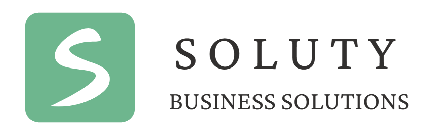
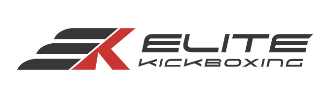
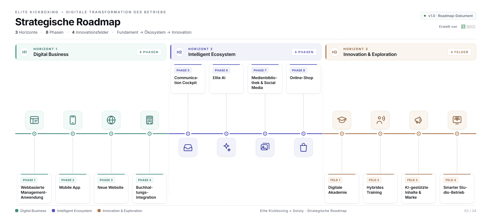
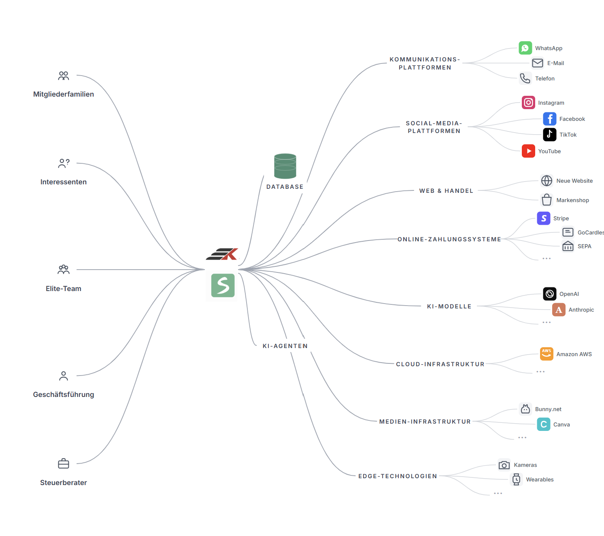
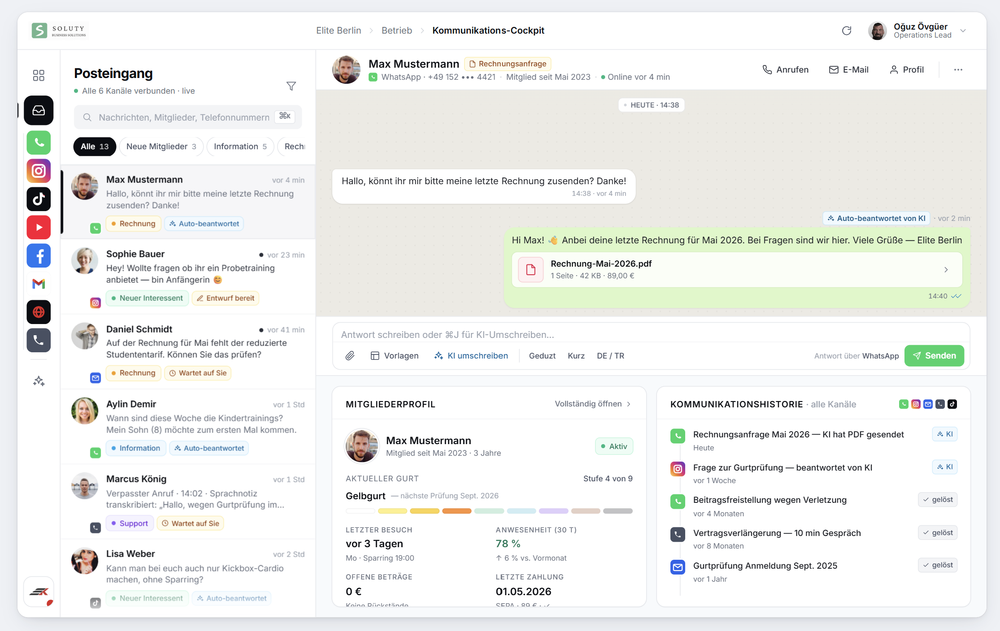
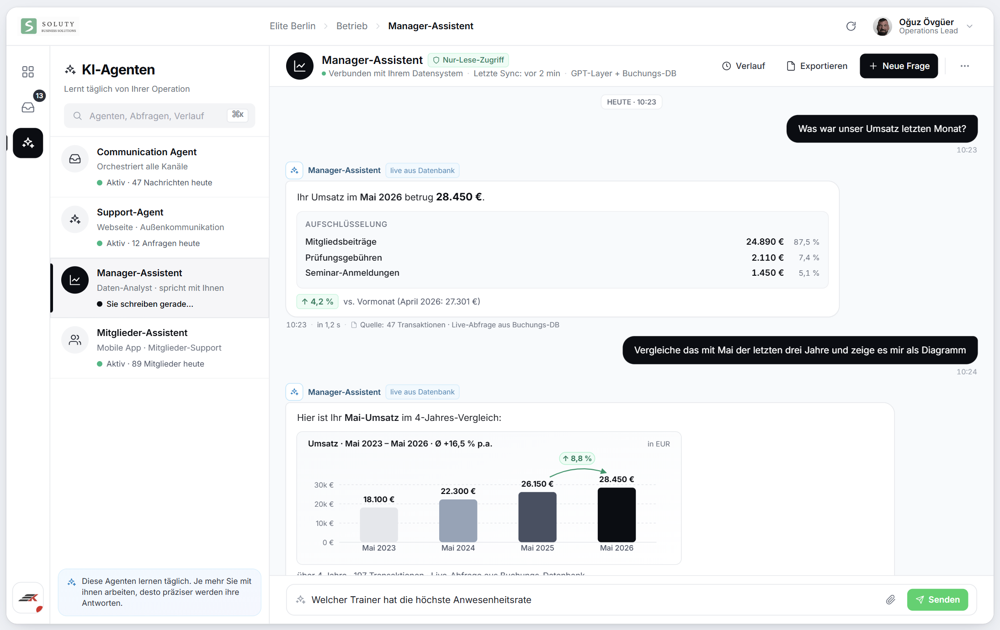
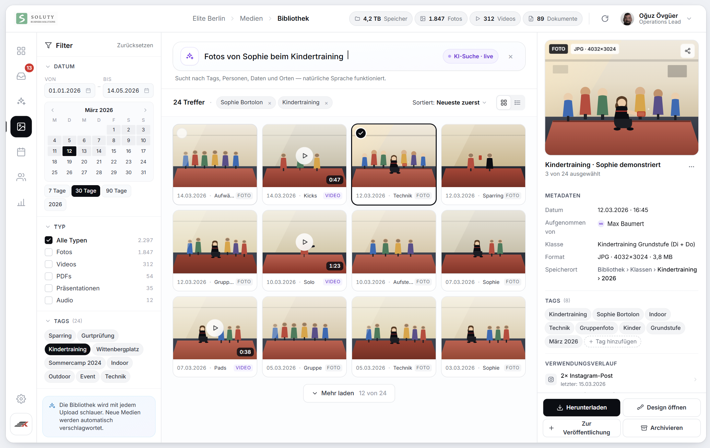

  

    
    
  

  

    
Strategic Roadmap

    <h1>
      Elite Kickboxing'in 
      Dijital Operasyon Dönüşümü
    </h1>

    

      Digital Business · Intelligent Ecosystem · Innovation & Exploration
    

  

  

    
Prepared by Soluty GmbH

    
Berlin · 2026

  

## 1. Executive Summary

İlk görüşmemizde bizim için en dikkat çekici noktalardan biri, ekibinizden gelen şu istekti:

> “Her şeyi tek platformdan görmek ve yönetmek istiyoruz.”

Bu cümle, aslında bu çalışmanın ana yönünü belirledi.

Çünkü büyüyen birçok işletmede benzer bir durum oluşur: üyelik bir yerde, ödemeler başka yerde, iletişim farklı kanallarda, sosyal medya ayrı bir dünyada, muhasebe başka bir sistemde yaşar. Başlangıçta bu normaldir. Ama işletme büyüdükçe bu dağınıklık zaman, dikkat ve kontrol kaybına dönüşür.

Bu dokümanda önerdiğimiz yol haritası, Elite’in bu dağınıklığı azaltarak daha düzenli, daha görünür ve daha yönetilebilir bir dijital yapıya geçmesini amaçlıyor.

---

### İşletmelerin teknoloji yolculuğu

Bu dönüşümü daha iyi anlatmak için işletmelerin teknoloji yolculuğunu üç dönem üzerinden düşünebiliriz.

#### Dün — Dijitalleşme Dönemi

Kâğıt, dosya ve manuel takip sistemleri bilgisayara taşındı.
Ana amaç, insanların yaptığı işi dijital ortamda daha düzenli tutmaktı.

#### Bugün — Entegrasyon ve Otomasyon Dönemi

Artık tek tek dijital araçlar yeterli değil.
Asıl ihtiyaç, bu araçların birbirine bağlanması ve işlerin mümkün olduğunca otomatik akması.

#### Yarın — Akıllı İşletme Dönemi

Yapay zekâ ile birlikte teknoloji sadece kayıt tutan bir araç olmaktan çıkıyor.
Sistemler zamanla veriyi anlamaya, tekrar eden işleri azaltmaya ve karar süreçlerini desteklemeye başlıyor.

Bu noktada önemli bir gerçek var:

> Yapay zekâdan gerçek değer üretmek için önce güçlü bir operasyonel temel gerekir.

Dağınık veri ve kopuk sistemler üzerine kurulan AI çözümleri uzun vadede güçlü sonuç üretmez. Bu nedenle ilk adım, Elite’in operasyonunu sağlam bir dijital temele oturtmaktır.

---

### Yol haritasının yapısı

Bu çalışma üç ana Horizont üzerine kuruludur.

Her Horizont, Elite için farklı bir gelişim seviyesini temsil eder. Her faz ise kendi içinde değer üreten, bağımsız ilerleyebilen bir teslimat olarak düşünülmüştür.

Bu bir “hepsi ya da hiçbiri” yaklaşımı değildir.
Her faz sonunda durulabilir, öncelikler değiştirilebilir veya sonraki adımlar birlikte yeniden değerlendirilebilir.

---

  

*Üç Horizont, sekiz faz ve dört inovasyon alanı tek bir zaman çizgisinde.*

---

### Horizont 1 — Digital Business

Bu aşamada Elite’in temel iş süreçleri dijital bir omurgaya taşınır.

Üyelik, sözleşme, ödeme, ders, sınav, mobil uygulama, web sitesi ve muhasebe tarafı daha düzenli ve takip edilebilir hâle gelir.

Bu Horizont, bütün yapının temelidir. Çünkü daha akıllı sistemler kurabilmek için önce verinin ve operasyonun düzenli şekilde dijitalleşmiş olması gerekir.

Bu aşamanın sonunda Elite, günlük operasyonunu sistem üzerinden yöneten modern bir işletme yapısına yaklaşır.

---

### Horizont 2 — Intelligent Ecosystem

Horizont 1’de kurulan temel, bu aşamada daha bağlı ve daha akıllı hâle gelir.

İletişim, yapay zekâ desteği, medya yönetimi, sosyal medya ve online shop aynı sistem mantığına yaklaşır. Amaç yeni araçlar eklemek değil; Elite’in farklı yerlere dağılmış operasyonunu tek platform altında daha görünür ve daha yönetilebilir hâle getirmektir.

Bu aşamada sistem yalnızca kayıt tutan bir yapı olmaktan çıkar; tekrar eden işleri azaltan, ekibin kararlarını destekleyen ve zamanla Elite’i daha iyi tanıyan bir yardımcı katmana dönüşür.

---

### Horizont 3 — Innovation & Exploration Layer

Horizont 3, önceki iki Horizont’tan farklıdır.

Burada net teslimat fazları değil, gelecekte değerlendirilmesi gereken inovasyon alanları anlatılır. Amaç bugünden kesin ürün sözü vermek değildir. Amaç, teknolojinin gittiği yönü takip etmek ve Elite’in ileride hangi alanlarda öncü olabileceğini şimdiden düşünmeye başlamaktır.

Dijital akademi, antrenör bilgisinin dijitalleşmesi, hibrit antrenman deneyimi, AI destekli içerik üretimi ve akıllı salon operasyonu gibi başlıklar bu kapsamda değerlendirilir.

---

## Fazlar ve İnovasyon Alanları

### Horizont 1 — Digital Business

#### Faz 1 — Web tabanlı yönetim uygulaması

Tüm üyeler, sözleşmeler, ödemeler, dersler ve sınavlar gibi temel operasyonlar bu sistemden yönetilir.

Bu faz, Elite’in günlük işleyişinde kullanılacak ana yönetim altyapısını oluşturur.

#### Faz 2 — Mobil Uygulama

Üyelerin, velilerin ve antrenörlerin kullanacağı iOS ve Android mobil uygulama hazırlanır.

Üyeler derslerini, üyelik bilgilerini, ödeme geçmişlerini ve gelişim süreçlerini mobil uygulama üzerinden takip edebilir.

#### Faz 3 — Yeni Web Sitesi

Elite’in dış dünyaya açılan dijital yüzü yenilenir.

Yeni web sitesi yalnızca tanıtım sayfası değil; deneme dersi, üyelik başlangıcı, etkinlik kayıtları ve sistemle bağlantılı web girişleri için aktif bir kanal olur.

#### Faz 4 — Muhasebe Entegrasyonu

Operasyon sistemi muhasebe tarafıyla daha düzenli çalışmaya başlar.

Fatura, ödeme ve kayıt süreçleri Steuerberater ile paylaşılabilir hâle gelir. Gerektiğinde DATEV ve e-Rechnung süreçleri bu yapıya bağlanır.

---

> **Not:** İlk görüşmede paylaştığınız ihtiyaçların büyük bölümü Faz 1 ve Faz 2 kapsamındadır. Sonraki fazların projeye dahil edilmesi tamamen sizin önceliklerinize göre değerlendirilir.

---

### Horizont 2 — Intelligent Ecosystem

#### Faz 5 — Communication Cockpit

WhatsApp, telefon, Instagram, YouTube, e-posta ve web sitesi gibi iletişim kanalları tek merkezde toplanır.

Gelen mesajlar konuya göre ayrılır, önceliklendirilir ve gerektiğinde cevap taslakları hazırlanır.

#### Faz 6 — Elite AI

Elite’in operasyonunu, üyelerini ve iletişim tarzını zamanla daha iyi tanıyan yapay zekâ katmanı kurulur.

Bu katman mesajları düzenlemeye, raporları daha hızlı anlamaya, üyelere temel konularda yardımcı olmaya ve tekrar eden işleri azaltmaya destek olur.

#### Faz 7 — Medya Kütüphanesi + Sosyal Medya

Elite’in fotoğraf, video ve marka dosyaları tek yerde toplanır.

Sosyal medya üretimi daha düzenli, planlı ve ölçülebilir hâle gelir.

#### Faz 8 — Online Shop

Online shop, Elite’in ana platform mantığına bağlanır.

Böylece ürün satışı, üyelik, etkinlik, iletişim ve kampanya akışları birbirinden kopuk çalışmak yerine aynı sistemin parçaları hâline gelir.

---

### Horizont 3 — Innovation & Exploration Layer

#### İnovasyon Alanı 1 — Dijital Akademi ve Antrenör Bilgisinin Dijitalleşmesi

Elite’in antrenör bilgisinin zamanla dijital referanslara dönüşmesi ve bu bilginin salon dışına da taşınabilmesi değerlendirilir.

#### İnovasyon Alanı 2 — AI Destekli Hibrit Antrenman Deneyimi

Salon içi dersler, ev çalışmaları, mobil uygulama ve kişisel gelişim takibi zamanla daha bağlı bir antrenman deneyimine dönüşebilir.

#### İnovasyon Alanı 3 — AI Destekli İçerik ve Marka Üretimi

Elite’in salonda zaten ürettiği görüntü, bilgi ve hikâyeler daha düzenli şekilde dijital içeriklere dönüştürülebilir.

#### İnovasyon Alanı 4 — Akıllı Salon Operasyonu ve Fiziksel Mekân Analitiği

Salon kullanımı, sınıf yoğunluğu, ekipman takibi ve operasyonel akışlar ileride daha ölçülebilir hâle gelebilir.

---

  

*Elite'in tüm paydaşları ve araçları tek bir omurgada birleşir.*

---

## Sonraki Adım

Dokümanın devamında her faz ve inovasyon alanı daha detaylı şekilde açıklanmıştır.

Bu yol haritası, tek seferde tamamlanması gereken sabit bir proje planı olarak değil; Elite’in önceliklerine göre şekillenebilecek yaşayan bir gelişim çerçevesi olarak düşünülmelidir.

## 2. Drei Horizonte — Unsere Vision für Elite
**Hedef sayfa:** 2

**Amaç:** Üç ufku müşterinin gözünde bir hikaye haline getirmek. Almanca isimlendirme kararı bu bölümde finalize edilir.

### 2.1 Horizont 1 — Digital Business
Horizont 1 dört fazdan oluşuyor. Her faz kendi içinde tamamlanan, ölçülebilir bir teslimat. Sıra mantıksal: önce operasyonun çekirdeği oturuyor, sonra üyelerin kullanacagi uygulama geliyor, ardından dış dünyaya yüzünüz olan web sitesi, en sonda mali entegrasyon. Her fazın bitişinde sistem çalışır halde ve kullanmaya baslayabilirsiniz.

Bu bölümde ⚖️ işaretini gördüğünüz her özellik Almanya yasal zorunluluğu içerir. Soluty altyapıyı standarda uygun kurar.

#### Faz 1 — Web Tabanlı Yönetim Sistemi

Bu fazın amacı Elite’in günlük operasyonunu tek merkezden yönetilebilir hâle getirmek.

Bugün farklı yerlere dağılmış olan üyelik, ödeme, sözleşme, devam takibi ve sınav süreçleri tek sistem altında toplanır. Böylece operasyon kişilere bağlı olmaktan çıkar, daha düzenli ve takip edilebilir bir yapıya dönüşür.

Bu ilk fazda üyeler henüz sistemi aktif kullanmaz. Öncelik, salon içi operasyonun sağlam bir temele oturtulmasıdır. Mobil uygulama ve üye deneyimi Faz 2’de devreye girer.

Bu yapı aynı zamanda sonraki tüm fazların teknik omurgasını oluşturur.

---

##### 🔐 Sistem Altyapısı

* Yetki bazlı kullanıcı yapısı
  Admin, operasyon sorumlusu ve antrenör için farklı erişim seviyeleri

* Çok dilli kullanım
  Almanca, İngilizce ve Türkçe

* Tüm önemli işlemler için değişiklik geçmişi
  Kim, ne zaman, neyi değiştirdi bilgisi sistemde tutulur

* Avrupa veri koruma standartlarına uygun altyapı ⚖️

* DSGVO kapsamında veri silme ve veri dışa aktarma akışları ⚖️

* Otomatik yedekleme sistemi

* Test ve canlı ortam ayrımı
  Yeni özellikler önce güvenli ortamda test edilir

* Operasyon bildirimleri
  Örneğin başarısız ödeme, uzun süre gelmeyen üye, yaklaşan sözleşme bitişi veya sınava hazır üyeler

* İleride ikinci şube açılması durumunda çoklu lokasyona uygun yapı

---

##### 👤 Üye ve Aile Yönetimi

* Üye profili, iletişim bilgileri ve üyelik geçmişi

* Üyelik durumu takibi
  Aktif, dondurulmuş, iptal edilmiş veya eski üye gibi durumların net görülmesi

* Aile hesabı yapısı
  Tek veli hesabından birden fazla çocuğun yönetilebilmesi

* Ortak fatura ve aile bazlı takip imkânı

* Sağlık beyanı ve onay süreçlerinin dijital arşivlenmesi ⚖️

---

##### 📄 Sözleşme ve Üyelik Süreçleri

* Dijital sözleşme oluşturma, onay ve PDF arşivleme akışı

* Üyenin onayladığı sözleşme ve AGB versiyonunun saklanması

* Onay zamanı, işlem geçmişi ve e-posta teyidi ile izlenebilir kayıt yapısı

* Üyelik başlangıç, bitiş ve yenileme takibi

* Üyelik dondurma süreçleri
  Hastalık, hamilelik, yurtdışı veya benzeri durumlar

* Özel fesih ve istisnai üyelik durumları için takip akışı

* Almanya’daki üyelik süreçlerine uygun fesih ve yenileme altyapısı ⚖️

* Kündigungsschaltfläche altyapısı ⚖️

Burada amaç sadece “kâğıdı dijitale taşımak” değildir.
Amaç; sözleşme, onay, yenileme ve fesih süreçlerini daha düzenli, izlenebilir ve sonradan kontrol edilebilir hâle getirmektir.

Gerekirse ileride belirli belgeler için qualified e-signature sağlayıcılarıyla entegrasyon ayrı olarak değerlendirilebilir. Standart Faz 1 kapsamındaki ana yaklaşım ise dijital onay, versiyonlama, PDF arşivi ve izlenebilir kayıt yapısıdır.

---

##### 💳 Ödeme ve Tahsilat

* SEPA otomatik tahsilat altyapısı

* SEPA mandate yönetimi

* Kart ile ödeme desteği

* Otomatik aylık ödeme akışı

* Dijital fatura oluşturma

* Başarısız ödemelerin otomatik takibi

* Geri dönen ödemeler için kademeli Mahnung akışı
  Yeniden deneme, Mahnung 1, Mahnung 2

* Üye bazlı ödeme geçmişi ve raporlama

Bu yapı sayesinde manuel ödeme takibi büyük ölçüde azalır.
Özellikle başarısız tahsilatlar ve Mahnung süreçleri sistematik şekilde takip edilebilir hâle gelir.

---

##### 🗓️ Ders ve Katılım Yönetimi

* Ders programı oluşturma

* Tekrarlayan ders planları

* Antrenör atamaları

* Kontenjan ve bekleme listesi yönetimi

* QR kod ile salon giriş sistemi

* Uzun süre gelmeyen üyelerin otomatik tespiti

Örneğin sistem “14 gündür gelmeyen üyeler” listesini otomatik oluşturabilir ve antrenöre iletişime geçme görevi verebilir.

---

##### 🥋 Dövüş Sporlarına Özel Yapı

Bu bölüm, sistemi standart bir spor salonu yazılımından ayıran ana katmandır.

* Kuşak ve Graduierung sistemi

* Elite’in eğitim yapısına uygun seviye hiyerarşisi

* Çocuk programı için ayrı kuşak veya renk bantları akışı

* Her seviye için minimum devam ve süre kuralları

* Teknik checklist yapısı

* Sınav günü planlaması

* Geçti / kaldı kayıtları

* Sertifika çıktıları

Amaç yalnızca üyelik yönetmek değil; Elite’in eğitim sistemini de dijital olarak düzenli hâle getirmektir.

---

##### 🎯 Etkinlik ve Seminer Yönetimi

* Seminer, workshop ve kamp oluşturma

* Kontenjan yönetimi

* Üye ve misafir katılım kaydı

* Etkinliğe özel ödeme akışı

* Katılım listesi ve sertifika yönetimi

---

##### 🧑‍🏫 Antrenör Operasyonu

* Antrenör profilleri

* Antrenörlerin ders programını görüntüleyebilmesi

* Operasyon görevleri
  Örneğin devamsız üyeye ulaşılması, sınava hazır üyelerin kontrolü veya takip edilmesi gereken durumlar

Bu yapı operasyonel yükü azaltırken antrenör tarafında da daha net bir takip sistemi oluşturur.

---

##### 📧 İletişim ve Bildirimler

* E-posta gönderimleri

* Hazır mesaj şablonları

* Otomatik iletişim akışları

Örneğin:

* Hoş geldin mesajı

* Ödeme bildirimi

* Doğum günü mesajı

* Sınav daveti

* Devamsızlık hatırlatması

* Toplu duyuru ve kampanya gönderimleri

Bu fazda iletişim öncelikli olarak e-posta üzerinden düşünülür. Daha gelişmiş çok kanallı iletişim yapısı Faz 5’te Communication Cockpit altında ele alınır.

---

##### 📊 Yönetim Paneli ve Raporlama

* Gelişmiş üye arama ve filtreleme

* Gelir ve tahsilat raporları

* Aktif üye takibi

* Devamsızlık analizi

* Kuşak dağılımı

* Sınava hazır üyeler listesi

* Antrenör bazlı ders ve katılım verileri

---

##### 🏁 Faz 1 Sonunda Elite’in Operasyonu

Bu faz tamamlandığında:

* Kâğıt sözleşme süreçleri büyük ölçüde ortadan kalkmış olur.
* Üye bilgileri tek yerde toplanır.
* Sözleşme ve onay süreçleri daha izlenebilir hâle gelir.
* Ödeme takibi otomatikleşir.
* Mahnung süreçleri daha düzenli yönetilir.
* Sınav ve devam süreçleri daha sistemli ilerler.
* Antrenörlerin operasyonel takibi netleşir.
* Günlük operasyon kişilere bağımlı olmaktan çıkar.

En önemlisi ise:

Elite’in ileride kurmak isteyebileceği bütün dijital yapıların temeli atılmış olur.

#### Faz 2 — Mobil Uygulama

Bu fazda Elite'in operasyon sistemi üyelerin ve antrenörlerin günlük kullanımına açılır.

Faz 1'de kurulan yönetim altyapısı çalışmaya devam eder; mobil uygulama ise bunun üyeye görünen yüzü olur. Tüm veriler aynı sistemde çalışır, sadece kullanım deneyimi telefona taşınır.

Uygulama iPhone ve Android cihazlarda "Elite Kickboxing" markasıyla yayınlanır.

##### 📱 Mobil Uygulama Temeli

- iOS ve Android mobil uygulaması
- Elite Kickboxing markalı App Store ve Play Store yayını
- Almanca, İngilizce ve Türkçe kullanım desteği
- Push bildirim altyapısı

Amaç burada sadece "uygulama sahibi olmak" değil; üyelerin Elite ile günlük temasını daha düzenli ve güçlü hâle getirmektir.

##### 👤 Üye Hesabı ve Profil Yönetimi

Üyeler kendi hesaplarını uygulama üzerinden yönetebilir.

Örneğin:

- iletişim bilgilerini güncelleme
- üyelik durumunu görüntüleme
- ödeme geçmişini görme
- faturaları indirme
- bildirim tercihlerini değiştirme

Sistem aynı zamanda farklı kullanıcı tiplerini ayırabilir:

- aktif üyeler
- eski üyeler
- misafir kullanıcılar

Böylece herkes yalnızca kendisine uygun içerikleri görür.

##### 📅 Ders ve Etkinlik Akışı

Üyeler uygulama üzerinden:

- ders programını görüntüleyebilir
- rezervasyon yapabilir
- rezervasyon iptal edebilir
- bekleme listesine katılabilir
- seminer ve etkinliklere kayıt olabilir

Örneğin bir derste yer açıldığında sistem sıradaki üyeye otomatik bildirim gönderebilir.

Yaklaşan dersler için hatırlatmalar da uygulama üzerinden çalışır.

##### 📝 Üyelik ve Sözleşme Süreçleri

Üye tarafındaki temel üyelik işlemleri uygulama üzerinden yönetilebilir.

Örneğin:

- sözleşme görüntüleme
- imzalı PDF arşivine erişim
- üyelik yenileme süreci
- üyelik iptal akışı
- veri indirme talebi
  - (DSGVO veri taşınabilirliği kapsamında)

Buradaki amaç üyeyi sürekli resepsiyona bağımlı bırakmamak.

##### 👨‍👩‍👧 Aile Kullanımı

Tek hesap üzerinden birden fazla aile üyesi yönetilebilir.

Örneğin bir veli:

- çocuklarının ders durumunu görebilir
- kuşak ilerlemesini takip edebilir
- sınav davetlerini görüntüleyebilir
- aile ödemelerini tek yerden yönetebilir

Özellikle çocuk gruplarında bu yapı operasyonu ciddi şekilde sadeleştirir.

##### 🥋 Kuşak ve Gelişim Takibi

Üyeler kendi gelişim süreçlerini uygulama üzerinden takip edebilir.

Örneğin:

- mevcut kuşak seviyesi
- bir sonraki kuşak için gereken devam durumu
- teknik kriter ilerlemesi
- antrenman geçmişi
- kazanılan sertifikalar

Amaç burada üyeye "oyunlaştırılmış bir sistem" sunmak değil; gelişimini daha görünür ve motive edici hâle getirmek.

##### 🧑‍🏫 Antrenör Profilleri

Uygulama içinde antrenörler için özel profil alanları bulunur.

Örneğin:

- uzmanlık alanları
- dereceler
- kısa özgeçmiş
- branş bilgileri

Bu bölüm Elite'in kurumsal görünümünü de güçlendirir.

##### 📋 Antrenör Tarafı

Antrenörler uygulamayı günlük operasyon aracı olarak kullanabilir.

Örneğin:

- kendi ders programını görüntüleme
- yoklama alma
- öğrenci notları ekleme
- teknik değerlendirme yapma
- sınav öncesi hazırlık listelerini görüntüleme

Böylece birçok işlem masaüstüne bağlı olmadan ilerler.

##### 💬 İletişim ve Destek

- Uygulama içi canlı destek sistemi
- Bildirim ve duyuru altyapısı
  - Örneğin:
    - sınav duyuruları
    - etkinlik hatırlatmaları
    - ödeme bildirimleri
    - önemli salon bilgilendirmeleri

##### 🏁 Faz 2 Sonunda Elite'in Operasyonu

Bu faz tamamlandığında:

- Üyeler temel işlemlerinin büyük bölümünü telefon üzerinden yönetebilir.
- Resepsiyon üzerindeki operasyon yükü azalır.
- Ailelerin takibi daha düzenli ilerler.
- Antrenörler günlük operasyonu daha pratik yönetir.
- Elite daha modern, düzenli ve kurumsal bir deneyim sunmaya başlar.

En önemlisi ise:

Elite artık sadece fiziksel bir salon değil, üyelerinin günlük hayatında sürekli temas hâlinde olan bir marka yapısına dönüşür.

#### Faz 3 — Yeni Web Sitesi

Bu fazda Elite'in web sitesi yenilenir ve sistemin dış dünyaya açılan yüzü hâline gelir.

Burada amaç sadece daha modern görünen bir site yapmak değildir. Yeni site, Faz 1'de kurulan operasyon sisteminin ve Faz 2'deki mobil uygulamanın web tarafındaki devamı olarak düşünülür.

Yeni bir ziyaretçi site üzerinden deneme dersi alabilir, kayıt sürecini başlatabilir veya etkinliklere ulaşabilir. Mevcut üye web üzerinden hesabına girebilir. Antrenör ya da yönetici de gerektiğinde web arayüzünden kendi işlemlerini yapabilir.

Kısaca site artık yalnızca bilgi veren bir sayfa değil, Elite'in internet üzerindeki aktif çalışma noktalarından biri olur.

---

##### 🎨 Marka ve kullanıcı deneyimi

Elite'in web sitesi, salonun içeride verdiği kaliteyi dışarıda da hissettirmelidir.

* Elite markasına uygun yeni tasarım dili
* Mobil öncelikli yapı
* Hızlı açılan sayfalar
* Sayfaların Google’ın kullanıcı deneyimi kriterlerine uygun teknik yapı ile hazırlanması
* Almanca, İngilizce ve Türkçe içerik yapısı
* Net, sade ve güven veren kullanıcı deneyimi

Siteye giren kişi birkaç saniye içinde Elite'in nasıl bir yer olduğunu anlayabilmelidir: disiplinli, profesyonel, ciddi ama ulaşılabilir.

---

##### 🔗 Sistemle entegre çalışan yapı

Yeni site bağımsız bir tanıtım sayfası gibi çalışmaz. Faz 1'de kurulan ana sistemle bağlantılı olur.

* Üye, veli, antrenör ve yönetici için web girişi
* Web üzerinden deneme dersi rezervasyonu
* Web üzerinden üyelik başlangıcı
* Seminer, kamp ve etkinlik kayıtları
* Sözleşme yenileme akışları
* Kündigungsschaltfläche ⚖️

Buradaki önemli nokta şudur:

Siteden gelen bilgi tekrar elle sisteme girilmez. Ziyaretçi web'de bir işlem yaptığında, bu bilgi doğrudan ana sisteme akar.

Bu hem hata ihtimalini azaltır hem de operasyon ekibinin işini sadeleştirir.

---

##### 🔍 Google ve yapay zekâ çağında görünürlük

İnsanların internette arama yapma biçimi değişiyor.

Bugün hâlâ Google çok önemli. Ama insanlar artık ChatGPT, Perplexity ve Google AI gibi yapay zekâ destekli sistemlere de soru sormaya başlıyor.

Örneğin:

* Berlin'de iyi bir kickboxing salonu nerede?
* Çocuklar için kickbox eğitimi Berlin'de nerede alınır?
* WAKO odaklı kickboxing academy var mı?

Yeni site bu yeni arama alışkanlıklarına uygun şekilde hazırlanır.

* Berlin odaklı yerel SEO altyapısı
* Google tarafından daha iyi anlaşılabilecek sayfa yapısı
* Yapay zekâ sistemlerinin okuyabileceği temiz içerik düzeni
* Salon, antrenörler, dersler, etkinlikler ve sık sorulan sorular için yapısal veri altyapısı
* Google Business Profile ile uyumlu yapı
* robots.txt ve sitemap.xml altyapısı

Bu teknik detayların amacı basit:

Elite'in internette daha kolay bulunması ve doğru şekilde anlaşılması.

---

##### ⚖️ Yasal altyapı

Almanya'da web sitesi tarafında bazı konular düzgün kurulmalıdır.

* Impressum
* Datenschutzerklärung
* AGB sayfaları
* DSGVO / TDDDG uyumlu cookie yönetimi
* Güvenli veri işleme altyapısı

Bu bölümde Soluty teknik altyapıyı hazırlar. Hukuki metinlerin son kontrolü gerektiğinde hukuk veya danışmanlık tarafıyla birlikte ilerletilebilir.

Ama hedef nettir:

Site güzel görünsün, hızlı çalışsın, ama aynı zamanda Almanya'daki temel web gerekliliklerine de uygun olsun.

---

##### 💬 İletişim ve dönüşüm kanalları

Site yalnızca bilgi vermemeli, iletişimi de kolaylaştırmalıdır.

* WhatsApp bağlantısı
* İletişim formu
* Google Maps ve yol tarifi
* Tek tıkla arama
* Deneme dersi başvuru akışı
* Etkinlik ve seminer başvuru akışları

Birçok kişi telefonla aramak yerine önce kısa bir mesaj yazmayı tercih ediyor. Bu yüzden WhatsApp, iletişim formu ve deneme dersi akışlarının net olması önemlidir.

Siteye gelen kişi “ne yapmam gerekiyor?” diye düşünmeden bir sonraki adıma geçebilmelidir.

---

##### 📰 İçerik altyapısı

Elite'in güçlü taraflarından biri gerçek hikâyelere sahip olmasıdır.

Antrenörler, öğrenciler, sınavlar, kamplar, başarı hikâyeleri ve salon kültürü web sitesinde daha düzenli görünür hâle getirilebilir.

* Blog veya haber bölümü
* Antrenör tanıtım sayfaları
  Dereceler, uzmanlık alanları, deneyim ve kişisel hikâye
* Ders ve program sayfaları
* Çocuk grupları için ayrı açıklama alanları
* Fotoğraf ve video galerisi
* Instagram ve YouTube bağlantıları

Buradaki amaç Elite'e sürekli içerik üretme baskısı yüklemek değildir.

Ama salonun içinde zaten oluşan değer zamanla web sitesinde de görünür hâle gelmelidir. Bu hem marka güvenini artırır hem de yeni üyelerin karar vermesini kolaylaştırır.

---

##### 🏁 Faz 3 sonunda Elite'in durumu

Bu faz tamamlandığında Elite'in web sitesi yalnızca bir tanıtım sayfası olmaktan çıkar.

* Yeni ziyaretçiler web sitesinden deneme dersi oluşturabilir.
* Üyelik süreci web üzerinden başlayabilir.
* Mevcut üyeler web'den hesaplarına erişebilir.
* Etkinlik ve seminer kayıtları daha düzenli ilerler.
* Site üzerinden gelen bilgiler doğrudan ana sisteme bağlanır.
* Elite Google ve yeni nesil arama kanallarında daha görünür hâle gelir.

En önemlisi şu:

Elite'in dijital görüntüsü, salonun içeride verdiği kaliteye yaklaşır. Web sitesi artık dışarıdan bakan biri için sadece bilgi kaynağı değil, Elite ile ilk gerçek temas noktası olur.

#### Faz 4 — Muhasebe Entegrasyonu

Faz 1’de kurulan sistem artık muhasebe tarafıyla da düzenli çalışmaya başlıyor.
Amaç muhasebecinin yerine geçmek değil; Elite’in operasyonuyla Steuerberater’ın kullandığı dünya arasındaki manuel işi azaltmak.

Bugün birçok salonda ay sonu hâlâ Excel, PDF, banka hareketi ve manuel kontrol üzerinden ilerliyor. Bu fazda o taraf daha düzenli hâle geliyor.

---

##### 📤 DATEV ve e-Rechnung

* DATEV ihracı
  Steuerberater’ın ihtiyaç duyduğu kayıtların XML veya CSV formatında düzenli dış aktarımı

* e-Rechnung desteği
  XRechnung ve ZUGFeRD standartlarına uygun fatura altyapısı

* Aylık muhasebe paketi
  Fatura, ödeme, iade ve ilgili kayıtların Steuerberater için düzenli hazırlanması

* Steuerberater paylaşım akışı
  Muhasebe tarafıyla düzenli veri paylaşımı için ortak workflow

Buradaki hedef, ay sonlarında “dosya toplama operasyonu” yaşamamak.

---

##### 🗄️ Denetim ve kayıt düzeni

* GoBD uyumlu kayıt altyapısı
  Kayıtların saklanması, değişiklik geçmişi, denetlenebilir loglar ve sonradan izlenebilir yapı

* Arşiv düzeni
  Fatura, ödeme ve sözleşme kayıtlarının uzun süreli saklanması

* İzlenebilirlik
  Kim hangi kaydı ne zaman değiştirdi bilgisi sistem içinde tutulur

* Yıllık vergi süreci için dışa aktarılabilir kayıt yapısı

Burada amaç “kurumsal görünmek” değil; birkaç yıl sonra dönüp bakıldığında sistemin hâlâ düzenli çalışıyor olması.

---

##### 🏁 Faz 4 sonunda Elite’in durumu

Bu faz tamamlandığında Elite’in operasyon sistemi artık sadece salon içini değil, muhasebe tarafını da düzenli besleyen bir yapıya dönüşür.

* Operasyon ve muhasebe tarafı aynı veriyle çalışmaya başlar.
* Steuerberater’a veri hazırlamak ciddi ölçüde kolaylaşır.
* Ay sonu kontrol yükü azalır.
* Kayıt düzeni daha denetlenebilir hâle gelir.
* Vergi denetimi gibi durumlarda bilgiye ulaşmak kolaylaşır.
* Yıllık vergi süreci için gerekli kayıtlar daha düzenli hazırlanabilir.

En önemlisi şu:

Elite’in finansal kayıt tarafı da günlük operasyonun doğal parçası hâline gelir. Böylece muhasebe, sonradan toparlanan ayrı bir yük olmaktan çıkar ve sistemin düzenli beslediği bir süreç hâline yaklaşır.

---

## Horizont 1 tamamlandığında Elite’in geldiği nokta

Dört fazın sonunda Elite Kickboxing:

* Kâğıt sözleşmeden büyük ölçüde çıkmış
* Üye, ödeme, ders ve sınav süreçlerini tek sistemde yöneten
* Üyelerinin aktif kullandığı markalı bir mobil uygulamaya sahip
* Yeni web sitesiyle internetten doğrudan üye kazanabilen
* Steuerberater ile daha düzenli çalışan
* Günlük operasyon yükünü ciddi ölçüde azaltmış
* Operasyonel kararlarını daha görünür veriyle verebilen bir yapıya ulaşır

En önemlisi şu:

Bu yapı sadece “bir yazılım kurulmuş olması” değil,
Elite’in gelecekteki tüm dijital adımlarını taşıyabilecek operasyonel temelinin oluşmasıdır.

Horizont 2 bu temel üzerine kurulacaktır.

### 2.2 Horizont 2 — Tek Platform & Dahili Yapay Zekâ

Horizont 1'de Elite'in dijital operasyon temeli kurulmuş olur.
Horizont 2'de ise bu temel daha bağlı ve daha akıllı bir yapıya dönüşür.

Bu aşamada iletişim, yapay zekâ desteği, medya yönetimi, sosyal medya ve online shop aynı sistem mantığına yaklaşır. Amaç yeni araçlar eklemek değil; Elite'in farklı yerlere dağılmış operasyonunu tek platform altında daha görünür ve daha yönetilebilir hâle getirmektir.

Sistem zamanla yalnızca kayıt tutan bir yapı olmaktan çıkar; Elite'i tanıyan, tekrar eden işleri azaltan ve ekibin günlük kararlarını destekleyen bir yardımcı katmana dönüşür.

Horizont 2'nin ana fazları
Faz 5 — Communication Cockpit
Faz 6 — Dahili AI Katmanı
Faz 7 — Medya Kütüphanesi ve Sosyal Medya Yönetimi
Faz 8 — Online Shop

Bu katmanın temel fikri basit:

Elite'in farklı parçaları artık ayrı ayrı çalışmaz; aynı sistem içinde birbirini beslemeye başlar.

#### Faz 5 — Communication Cockpit

Bu fazda Elite'in farklı kanallara dağılmış iletişimi tek bir merkezde toplanır.

Bugün bir üye WhatsApp'tan yazabilir, yeni bir aday Instagram'dan mesaj atabilir, biri web sitesindeki formu doldurabilir, başka biri telefonla arayabilir. Bu kanallar ayrı ayrı takip edildiğinde bazı şeylerin gözden kaçması çok kolaydır.

Communication Cockpit bu dağınıklığı azaltmak için tasarlanır.

Hangi kanaldan gelirse gelsin, mesajlar tek bir ekranda toplanır. Sistem mesajın kimden geldiğini, neyle ilgili olduğunu ve ne kadar acil olduğunu anlamaya çalışır. Basit konularda hazır cevap önerir, daha hassas konularda ise ekibe görev olarak bırakır.

Buradaki amaç insanı devreden çıkarmak değildir. Ama günlük iletişimin daha düzenli, daha takip edilebilir ve daha az yorucu hâle gelmesidir.

---

##### 🧭 Tek ekranda iletişim yönetimi

Communication Cockpit, Elite'in iletişim trafiğini tek yerde toplar.

* 🟢 WhatsApp mesajları
* 📸 Instagram DM ve yorumları
* 🔵 Facebook mesajları ve yorumları
* 🎵 TikTok mesajları ve yorumları
* ▶️ YouTube yorumları
* 📧 E-posta mesajları
* 🌐 Web sitesi iletişim formu
* 📞 Telefon görüşmeleri ve görüşme notları

Ekip her kanalı ayrı ayrı kontrol etmek zorunda kalmaz. Gelen konular tek listede görünür.

Örneğin:

* yeni üye adayı
* mevcut üye sorusu
* ödeme konusu
* sözleşme veya üyelik değişikliği
* etkinlik sorusu
* acil destek talebi

gibi başlıklar sistem tarafından ayrılabilir.

---

  

*Communication Cockpit — tüm kanallar tek ekranda, yapay zekâ ile kategorize ve önceliklendirilmiş.*

---

##### 🤖 Yapay zekânın rolü

Yapay zekâ burada ana karar verici değil, operasyonu düzenleyen yardımcı katmandır.

* Gelen mesajın konusunu anlamaya çalışır
* Mesajı doğru kategoriye ayırır
* Acil görünen konuları öne çıkarır
* Basit sorular için cevap taslağı hazırlar
* Daha önce onaylanmış cevapları kullanabilir
* Aynı kişinin farklı kanallardan yazdığı mesajları ilişkilendirmeye çalışır
* Geçmiş konuşmaları ekip için görünür hâle getirir

Örneğin biri Instagram'dan “deneme dersi var mı?” diye yazdığında sistem bu mesajı yeni üye adayı olarak işaretleyebilir ve deneme dersi linkiyle bir cevap taslağı hazırlayabilir.

Hassas konular yine ekibin kontrolünde kalır.

Örneğin:

* üyelik iptali
* ödeme problemi
* sağlıkla ilgili özel durum
* şikâyet
* hukuki ifade gerektiren konular

Bu tür durumlarda sistem otomatik karar vermek yerine konuyu görünür hâle getirir ve ilgili kişiye bırakır.

---

##### 🌐 Kanalların birleşmesi

Communication Cockpit'in asıl değeri, kanalları tek tek bağlamaktan çok, bunları aynı operasyon mantığında birleştirmesidir.

WhatsApp'tan yazan biri daha sonra Instagram'dan da mesaj atarsa, sistem bunun aynı kişi olabileceğini anlayabilir.

Telefonla arayan bir üyenin geçmiş mesajları ekranda görünebilir.

Web sitesinden gelen deneme dersi talebi doğrudan yeni aday listesine düşebilir.

Instagram yorumunda “yeriniz nerede?” diye soran bir kişiye, ekip hızlıca Google Maps bağlantısı gönderebilir veya sistem bunun için hazır cevap önerebilir.

Böylece iletişim sadece cevap verilen bir alan olmaktan çıkar; takip edilen, ölçülen ve yönetilen bir operasyon alanına dönüşür.

---

##### 📞 Telefon görüşmeleri

Telefon hâlâ birçok işletme için önemli bir kanal. Ama çoğu zaman telefonda konuşulan şey sistemde yaşamaz.

Bu fazda modern dijital telefon altyapıları değerlendirilerek telefon iletişiminin de sisteme bağlanması mümkün olabilir.

* Arayan kişinin üye kaydı ekranda görülebilir
* Görüşme sonrası kısa not eklenebilir
* Konu ilgili üyeye veya aday kaydına bağlanabilir
* Gerektiğinde konuşma özeti oluşturulabilir
* Takip edilmesi gereken konu görev olarak işaretlenebilir

Burada amaç telefon görüşmesini karmaşıklaştırmak değildir. Tam tersine, telefonda konuşulan önemli bilgilerin kaybolmamasıdır.

---

##### 🌅 Günlük kullanım örneği

Sabah operasyon sorumlusu sistemi açtığında tek ekranda günün iletişim özetini görebilir.

Örneğin:

* Üç yeni kişi deneme dersi sormuş
* İki mevcut üye ödeme konusuyla ilgili yazmış
* Bir veli çocuğunun sınav tarihi hakkında bilgi istemiş
* Instagram'da bir gönderinin altında konum sorulmuş
* Bir üye üyelik dondurma talebi göndermiş

Sistem bu mesajları kanala göre değil, konuya göre düzenler.

Yeni adaylar ayrı görünür.
Ödeme konuları ayrı görünür.
Acil veya dikkat isteyen konular öne çıkar.

Ekip de günün iletişimini farklı uygulamalar arasında kaybolmadan yönetebilir.

---

##### 🧩 Faz 1, Faz 2 ve Faz 3 ile bağlantısı

Communication Cockpit tek başına duran ayrı bir araç değildir.

Faz 1'deki üye ve operasyon verisiyle bağlantılı çalışır.
Faz 2'deki mobil uygulama bildirimleriyle ilişkilenebilir.
Faz 3'teki web sitesi formları ve deneme dersi akışlarıyla birleşir.

Örneğin web sitesinden gelen bir deneme dersi talebi önce Communication Cockpit'e düşer. Sonra aday kaydına dönüşür. Kişi üyeliğe geçerse Faz 1'deki ana sisteme bağlanır.

Böylece iletişim sadece mesaj olarak kalmaz; operasyonun parçası olur.

---

##### 🏁 Faz 5 sonunda Elite'in operasyonu

Bu faz tamamlandığında Elite'in iletişim tarafı daha düzenli çalışmaya başlar.

* Farklı kanallardan gelen mesajlar tek yerde görünür.
* Yeni üye adayları daha kolay takip edilir.
* Mevcut üyelerin talepleri kaybolmaz.
* Ekip hangi konunun kimde olduğunu daha net görür.
* Basit sorular için cevap hazırlamak hızlanır.
* Hassas konular insan kontrolünde kalır.
* Telefon, sosyal medya, e-posta ve web sitesi aynı operasyon akışına yaklaşır.

En önemlisi şu:

Elite iletişimi yetiştirmeye çalışan bir ekip olmaktan çıkar; iletişimi daha bilinçli yöneten bir yapıya yaklaşır.

#### Faz 6 — Elite AI

Bu fazda Elite'in kendi operasyonunu tanıyan yapay zekâ katmanı kurulmaya başlar.

Buradaki fikir, dışarıdan alınmış genel bir chatbot kullanmak değildir. Amaç; Elite'in üyelerini, iletişim tarzını, operasyon yapısını ve günlük ihtiyaçlarını zamanla daha iyi anlayan bir yardımcı sistem oluşturmaktır.

AI burada her zaman karar verici değildir. Sistem mesajları düzenler, cevap taslakları hazırlar, verileri daha hızlı okunur hâle getirir ve tekrar eden işleri azaltmaya yardımcı olur. Karmaşık, hassas veya hukuki sonuç doğurabilecek konular her zaman insan kontrolünde kalır. Ancak AI, kendisine izin verildigi olcude otomatik yanitlar uretir ve dogrudan insanlara cevap verir.

---

##### 🤖 Elite AI'ın temel parçaları

Başlangıçta yapay zekâ katmanı birkaç ana yardımcı yapı üzerinden düşünülebilir.

Her biri farklı bir alana destek verir; ama hepsi aynı sistemden ve aynı operasyon verisinden beslenir.

---

##### 💬 Communication Agent

Communication Cockpit'in yapay zekâ tarafıdır.

Farklı kanallardan gelen mesajları anlamaya, kategorilere ayırmaya ve önceliklendirmeye yardımcı olur.

* Yeni üye adaylarını ayırabilir
* Ödeme sorularını işaretleyebilir
* Üyelik değişikliği taleplerini öne çıkarabilir
* Basit sorular için cevap taslağı hazırlayabilir
* Daha hassas konuları ekibe bırakabilir

Örneğin bir üye WhatsApp'tan “Bu ay ödeme neden çekilmedi?” diye yazdığında sistem üyeyi tanıyabilir, ödeme durumunu kontrol edebilir ve ekibe hazır bir cevap taslağı sunabilir.

Son sözü yine ekip verir.

---

##### 🎯 Support Agent

Web sitesi ve ileride mobil uygulama üzerinde çalışabilecek destek asistanıdır.

Yeni gelen ziyaretçilere temel konularda yardımcı olabilir.

* Deneme dersi hakkında bilgi verebilir
* Çocuk grupları için yönlendirme yapabilir
* Üyelik sürecini açıklayabilir
* Sık sorulan sorulara cevap verebilir
* Gerektiğinde konuyu Elite ekibine aktarabilir

Örneğin bir veli web sitesinde “Çocuğum 9 yaşında, hangi gruba uygun?” diye sorduğunda sistem temel yönlendirme yapabilir ve deneme dersi formuna götürebilir.

Ama önemli nokta şudur:

Support Agent satış baskısı yapan bir robot gibi değil, düzgün bilgi veren sakin bir yardımcı gibi çalışmalıdır.

---

##### 📊 Yönetici Asistanı

Yönetici Asistanı, sistemdeki verileri daha kolay okunur hâle getiren yapıdır.

Amaç rapor aramak, Excel açmak veya birinden veri hazırlamasını beklemek yerine, temel sorulara daha hızlı cevap alabilmektir.

Örneğin:

* Geçen ay toplam gelir neydi?
* Son 30 günde kaç yeni üye geldi?
* Hangi derslerde devam oranı yüksek?
* Hangi üyeler uzun süredir gelmiyor?
* Hangi etkinlikler daha çok ilgi gördü?

Sistem bu sorulara mevcut veriler üzerinden cevap verebilir ve gerektiğinde grafik veya kısa özet hazırlayabilir.

Burada önemli olan şudur:

AI tahmin yürütmek yerine, sistemde bulunan gerçek veriye dayanmalıdır.

---

  

*Yönetici Asistanı — gerçek veriye anında erişim, otomatik üretilen grafiklerle anlamlı cevap.*

---

##### 👤 Üye Asistanı

Üye Asistanı, mobil uygulama içinde üyeye kendi bilgileriyle ilgili yardımcı olabilir.

* Kendi ders programını sorabilir
* Yaklaşan etkinlikleri görebilir
* Kuşak ilerlemesini takip edebilir
* Fatura veya ödeme geçmişine ulaşabilir
* Kendi üyelik durumuyla ilgili temel bilgi alabilir

Örneğin bir üye uygulamada “Bir sonraki kuşak sınavıma ne kaldı?” diye sorabilir.

Sistem, üyenin devam durumuna ve teknik checklist bilgilerine göre anlaşılır bir cevap verebilir.

Üye Asistanı'nın sınırları net olmalıdır.

* Başka üyelerin bilgisine erişemez
* Finansal işlem başlatamaz
* Hukuki söz veremez
* Sözleşme değişikliği yapamaz
* Hassas konularda ekibe yönlendirir

Bu sınırlar güven için önemlidir.

---

##### 🔄 Sistem zamanla nasıl öğrenir?

Elite AI ilk gün her şeyi bilen bir sistem olarak başlamaz.

Zamanla gelişir.

Ekip cevap taslaklarını düzeltir.
Hangi cevapların iyi çalıştığı görülür.
Hangi konuların insana aktarılması gerektiği netleşir.
Üyelerin sık sorduğu sorular birikir.
Operasyonun dili ve öncelikleri sistemde görünür hâle gelir.

Bu süreçte sistem yavaş yavaş Elite'in çalışma tarzını daha iyi anlamaya başlar.

Örneğin:

* Hangi sorulara otomatik cevap önerilebilir?
* Hangi konular mutlaka insana gitmeli?
* Hangi ifadeler Elite'in tonuna daha uygun?
* Hangi üyelik durumlarında dikkatli olmak gerekir?

Bu bir anda oluşan bir şey değildir.
Ama düzenli kullanıldığında değer zamanla artar.

---

##### 🧩 Faz 6'nın diğer fazlarla bağlantısı

Elite AI tek başına çalışan ayrı bir araç değildir.

Faz 1'deki operasyon verisini kullanır.
Faz 2'deki mobil uygulama içinde üyeye yardımcı olabilir.
Faz 3'teki web sitesinde ziyaretçileri yönlendirebilir.
Faz 5'teki Communication Cockpit içinde mesajları düzenleyebilir.

Yani AI, sistemin üzerine sonradan yapıştırılmış bir chatbot değil; mevcut operasyonu daha anlaşılır ve daha yönetilebilir hâle getiren destek katmanıdır.

---

##### 🏁 Faz 6 sonunda Elite'in operasyonu

Bu faz tamamlandığında Elite'in sistemi daha akıllı çalışmaya başlar.

* Gelen mesajlar daha hızlı sınıflandırılır.
* Basit sorular için cevap taslakları hazırlanır.
* Yöneticiler verilere daha kolay ulaşır.
* Üyeler kendi bilgileriyle ilgili daha hızlı cevap alabilir.
* Ekip tekrar eden işleri daha az elle yapmak zorunda kalır.
* Hassas kararlar insan kontrolünde kalır.
* Sistem zamanla Elite'in dilini ve çalışma tarzını daha iyi öğrenir.

En önemlisi şu:

Elite AI, ekibin yerine geçen bir sistem değil; ekibin daha düzenli, daha hızlı ve daha bilinçli çalışmasına yardımcı olan bir katman olur.

---

#### Faz 7 — Medya Kütüphanesi ve Sosyal Medya Yönetimi

Bu fazda Elite'in görsel birikimi ve sosyal medya akışı daha düzenli bir yapıya taşınır.

Elite'in içinde her gün değerli şeyler oluyor: antrenmanlar, sparring anları, sınavlar, kamplar, antrenörlerin teknik anlatımları, üyelerin gelişimi ve topluluk kültürü.

Bugün bu içeriklerin bir kısmı telefonlarda, bir kısmı farklı bulut klasörlerinde, bir kısmı sosyal medya hesaplarında, bir kısmı da hiç kullanılmadan arşivde kalıyor olabilir.

Bu fazın amacı iki şeyi birlikte çözmek:

* Elite'in medya arşivini tek yerde toplamak
* Sosyal medya üretimini daha düzenli ve takip edilebilir hâle getirmek

Burada hedef sadece daha fazla paylaşım yapmak değildir.
Asıl hedef, Elite'in salon içinde zaten ürettiği değeri dışarıya daha düzenli taşıyabilmektir.

---

##### 📚 Medya Kütüphanesi

Elite'in fotoğraf, video, PDF, sunum ve marka dosyaları tek bir medya kütüphanesinde toplanır.

Bu kütüphane, ekibin kolayca arama yapabileceği, dosyaları etiketleyebileceği ve gerektiğinde yeniden kullanabileceği bir yapı olur.

* Video, fotoğraf, PDF, sunum ve marka dosyalarının tek yerde toplanması
* Dosyaların tarih, etkinlik, antrenör, ders tipi veya kullanım durumuna göre etiketlenmesi
* Fotoğraf ve videolar için önizleme oluşturulması
* Eski içeriklerin kolay aranabilir hâle gelmesi
* Orijinal dosya ile sosyal medya için hazırlanmış versiyonların birlikte tutulması
* Logo, renk, font ve benzeri marka dosyalarının düzenli saklanması
* Kimlerin dosya yükleyebileceği veya görebileceği konusunda yetki yapısı
* Düzenli yedekleme altyapısı

Örneğin bir antrenör sparring dersinden kısa bir video yüklediğinde, bu video sadece telefonda kalmaz. Sisteme eklenir, ilgili ders ve antrenörle ilişkilendirilir, daha sonra sosyal medya, eğitim içeriği veya arşiv için tekrar kullanılabilir.

Aynı şekilde geçmişteki bir kamp fotoğrafı gerektiğinde, klasör klasör aramak yerine sistemden aranabilir.

Bu yapı zamanla Elite'in dijital hafızası hâline gelir.

---

  

*Medya Kütüphanesi — yapay zekâ destekli arama, tarih ve etkinlik bazlı filtreleme.*

---

##### 📅 Sosyal Medya Yönetimi

Sosyal medya tarafında amaç, paylaşım yapmayı son dakika işinden çıkarıp daha düzenli bir akışa oturtmaktır.

* İçerik takvimi
* Taslak, onay, planlanmış ve yayınlanmış içerik durumları
* Instagram, Facebook, TikTok ve YouTube için yayın planlama
* Tek içeriğin farklı platformlara uygun hazırlanması
* Bir içeriğin sosyal medya, web sitesi ve e-posta gibi farklı kanallara uyarlanabilmesi
* Caption ve hashtag taslakları
* Canva veya benzeri tasarım araçlarıyla bağlantı
* Üyelerin Elite'i etiketlediği içeriklerin görünür hâle gelmesi
* Yayınlanan içeriklerin performans takibi

Örneğin bir sparring videosu medya kütüphanesine yüklendiğinde, ekip bunu Instagram Reels, TikTok videosu veya YouTube Shorts için kullanabilir.

Sistem aynı içeriğin farklı platformlara göre uyarlanmasına yardımcı olabilir. Böylece ekip her şeyi sıfırdan hazırlamak zorunda kalmaz.

Buradaki amaç sosyal medyayı tamamen otomatikleştirmek değildir.
Ama içerik üretimini daha düzenli, daha ölçülebilir ve daha az yorucu hâle getirmektir.

---

##### 🤖 Elite AI ile içerik desteği

Bu fazda Elite AI, medya ve sosyal medya tarafına da yardımcı olabilir.

* Video veya fotoğraf için açıklama taslağı hazırlayabilir
* Farklı platformlara uygun metin önerileri sunabilir
* Daha önce iyi çalışan içeriklere bakarak öneriler verebilir
* Uzun bir videodan kısa içerik fikirleri çıkarabilir
* Belirli bir etkinlik için paylaşım planı önerebilir
* Trend olan konuların Elite'e uygun olup olmadığını değerlendirebilir

Örneğin yeni bir sparring videosu yüklendiğinde sistem şöyle bir öneri hazırlayabilir:

> Bu video kısa bir Reels için uygun görünüyor. İlk 3 saniyede dikkat çekecek bir başlık kullanılabilir. Altyazı eklemek iyi olur. Instagram ve TikTok için iki farklı açıklama taslağı hazırlanabilir.

Bu öneriler son karar değildir.
Ekip isterse kullanır, isterse değiştirir, isterse hiç kullanmaz.

AI burada sosyal medya uzmanının yerini almak için değil, ekibin üretim yükünü azaltmak için çalışır.

---

##### 🌍 Trend ve algoritma farkındalığı

Sosyal medya platformları sürekli değişiyor. Hangi formatın daha iyi çalıştığı, hangi saatlerde paylaşım yapılacağı, hangi içeriklerin daha çok izlendiği zamanla değişebilir.

Sistem bu noktada ekibe basit bir destek sağlayabilir.

* Hangi içerikler daha iyi izleniyor?
* Hangi saatlerde daha iyi etkileşim geliyor?
* Hangi konular daha çok ilgi görüyor?
* Hangi platformda hangi format daha iyi çalışıyor?
* Dövüş sporları dünyasında hangi konular gündemde?

Örneğin büyük bir dövüş organizasyonu yaklaşırken sistem, Elite'in buna uygun bir içerik hazırlayıp hazırlamayacağını ekibe hatırlatabilir.

Bu bölümde dikkat edilmesi gereken şey şudur:

Hiçbir sistem takipçi sayısını garanti edemez.
Algoritmaları platformlar belirler.

Ama düzenli içerik, doğru format, iyi zamanlama ve ölçüm, Elite'in dijital görünürlüğünü zaman içinde güçlendirebilir.

---

##### 🧩 Diğer fazlarla bağlantısı

Bu faz tek başına bir sosyal medya aracı değildir.

Faz 1'deki antrenör, ders ve etkinlik bilgileriyle bağlantılı çalışabilir.
Faz 2'deki mobil uygulama üzerinden içerik yükleme veya duyuru akışları desteklenebilir.
Faz 3'teki web sitesi için blog, galeri ve antrenör sayfalarına içerik sağlayabilir.
Faz 6'daki Elite AI içerik önerileri ve açıklama taslakları hazırlayabilir.

Böylece medya sadece arşivde duran dosyalar olmaktan çıkar; Elite'in marka, iletişim ve topluluk yapısını besleyen bir varlığa dönüşür.

---

##### 🏁 Faz 7 sonunda Elite'in operasyonu

Bu faz tamamlandığında Elite'in medya ve sosyal medya tarafı daha düzenli çalışmaya başlar.

* Fotoğraf, video ve marka dosyaları tek yerde toplanır.
* Eski içeriklere ulaşmak kolaylaşır.
* Sosyal medya paylaşımları daha planlı ilerler.
* Tek içerik farklı platformlarda daha verimli kullanılabilir.
* Ekip son dakika paylaşım stresinden uzaklaşır.
* Hangi içeriklerin daha iyi çalıştığı daha net görülür.
* Elite'in salon içindeki gerçek değeri dışarıda daha düzenli görünür hâle gelir.

En önemlisi şu:

Elite'in her gün salonda ürettiği emek, bilgi ve atmosfer zamanla dijital tarafta da görünür bir marka değerine dönüşür.

---

#### Faz 8 — Online Shop

Bu fazda online shop, Elite'in ana dijital sistemiyle birlikte düşünülür.

Buradaki konu sadece ürün satışı değildir. Asıl konu, Elite ile temas eden insanların sisteme daha düzenli şekilde dahil edilmesidir.

Bir kişi salona gelip üye olabilir.
Bir etkinliğe katılabilir.
Online shop üzerinden alışveriş yapabilir.
Sadece bir kamp veya seminer için kayıt oluşturabilir.

Bu kişilerin her biri Elite ile bir ilişki başlatmış olur.

Online shop bağımsız çalıştığında bu ilişki ayrı bir yerde kalır. Ana sistemle bağlantılı çalıştığında ise kişi, Elite ekosisteminin bir parçası hâline gelir.

---

##### 🛒 Online shop altyapısı

Online shop, Elite'in ürün satışlarını düzenli şekilde yönetebileceği bir yapı olarak kurulur.

* Ürün listeleme
* Ürün detay sayfaları
* Sepet ve ödeme akışı
* Sipariş takibi
* Satın alma geçmişi
* İade ve iptal süreçleri
* Stok takibi
* Sipariş durum bildirimleri

Buradaki amaç shop tarafını ayrı bir dünya gibi çalıştırmak değil, ana platforma bağlı bir ticaret alanı oluşturmaktır.

---

##### 👤 Müşteri ve üye ilişkisi

Online shop'tan alışveriş yapan kişi, sadece tek seferlik müşteri olarak kalmak zorunda değildir.

Sistem içinde bu kişiyle ilişki devam ettirilebilir.

* Shop müşterisi sisteme kayıt olabilir
* Event katilimcisina Shop urunleri sunulabilir, kampanyalar yapilabilir
* Shop musterisine event davetiyeleri gonderilebilir
* Event katılımcısı daha sonra üyelik teklifi alabilir
* Aktif üyeye ilgili ürün veya etkinlik önerisi yapılabilir
* Eski üyeye özel kampanya gönderilebilir
* Veli hesabı üzerinden çocukla ilgili satın alma veya etkinlik akışı kurulabilir

Bu yaklaşımda önemli olan şey şudur:

Elite ile temas eden herkes tek seferlik işlem olarak görülmez.
Zaman içinde tekrar ulaşılabilecek, daha iyi tanınabilecek ve doğru tekliflerle yeniden aktive edilebilecek bir ilişki olarak ele alınır.

---

##### 📱 Mobil uygulama ve iletişim bağlantısı

Online shop, mobil uygulama ve iletişim sistemiyle bağlantılı çalışabilir.

* Mobil uygulama içinde ürün veya kampanya gösterimi
* Sipariş durum bildirimleri
* Etkinlik sonrası ilgili tekliflerin gönderilmesi
* Shop sorularının Communication Cockpit'e düşmesi
* E-posta üzerinden kampanya ve bilgilendirme akışları
* Üye, event katılımcısı ve shop müşterisi için farklı iletişim listeleri

Kişi mobil uygulamayı kullanmasa bile e-posta veya diğer iletişim kanalları üzerinden Elite ile bağlantıda kalabilir.

Böylece online shop sadece satış yapılan bir yer değil, Elite'in ilişki kurduğu kanallardan biri olur.

---

##### 💳 Ödeme, fatura ve operasyon

Shop tarafındaki sipariş, ödeme ve fatura süreçleri mümkün olduğunca ana sistemle uyumlu çalışır.

* Online ödeme
* Siparişe bağlı fatura oluşturma
* Üye veya müşteri bazlı satın alma geçmişi
* İade ve iptal takibi
* Muhasebe entegrasyonuna uygun kayıt düzeni
* Stok ve satış raporları

Bu yapı Faz 4'teki muhasebe entegrasyonuyla birlikte düşünülebilir.

Amaç, shop satışlarının sonradan ayrıca toparlanması gereken yeni bir operasyon yüküne dönüşmemesidir.

---

##### 🧩 Platform içindeki yeri

Online shop, Elite'in tek platform yaklaşımını tamamlayan ticaret katmanıdır.

Faz 1'de üye ve operasyon verisi oluşur.
Faz 2'de mobil uygulama üyeyle temas noktası olur.
Faz 5'te iletişim tek merkezde toplanır.
Faz 8'de ise ürün satışı da bu yapıya bağlanır.

Böylece üyelik, etkinlik, iletişim ve ticaret birbirinden kopuk çalışmaz.

---

##### 🏁 Faz 8 sonunda Elite'in operasyonu

Bu faz tamamlandığında Elite'in online satış tarafı ana sistemle daha bağlı çalışmaya başlar.

* Online shop düzenli bir satış kanalına dönüşür.
* Shop müşterileri, event katılımcıları ve üyeler aynı sistem mantığında takip edilebilir.
* Ürün satışları iletişim ve kampanya akışlarına bağlanabilir.
* Sipariş, ödeme ve fatura kayıtları daha düzenli tutulur.
* Mobil uygulama ve e-posta kanalları ticaret tarafını destekleyebilir.
* Elite ile temas eden kişiler zaman içinde daha iyi tanınır.

En önemlisi şu:

Online shop yalnızca ürün satılan ayrı bir site olmaz.
Elite'in üyelik, etkinlik ve iletişim ekosistemine bağlı bir ilişki kanalı hâline gelir.

---

### 2.3 Horizont 3 — Innovation & Exploration

Bugün bütün sektörlerde olduğu gibi dövüş sanatları sektörü de çok büyük bir kırılımın eşiğinde duruyor. Son yıllardaki yapay zekâ devrimi, son 35 yılın "dijital + entegre" altyapısı üzerine yeni bir katmanı koymak üzere. Önümüzdeki beş yılda "bugün erken görünen ama yarın normal sayılacak" bircok yenilik Elite'in kapısını çalacak gibi gorunuyor. Belki de bulundugunuz sektorde tarihte gorulmemis degisiklikler, buna bagli "yeni is modelleri" ortaya cikabilir.
Bu katmandaki önerilerimiz, mevcut teknolojik gelismelerin sektore olabilecek olasi yansimalaridir. Teknolojinin yönü ve sektörün geleceği değerlendirilerek takip edilen stratejik gelişim alanlarıdır. Bazıları bugünden dünyada uygulanmaya başlayan ve gelişip standartlaşması beklenen teknolojilerdir. Bazıları ise zaten olgun, uygulanabilir teknolojilerdir. 

Bu Katmanın Üç Teknolojik Dayanağı var.

-Kameradan gelen görüntülerin sistem tarafından anlaşılması. Kamera artık sadece "kaydeden" değil, "anlayan" bir araç. Bir vurusun açısını, bir duruşun dengesini, bir hareketin biyomekaniğini analiz edebiliyor. Salona giris cikislari, sinif doluluk oranlarini takip edebiliyor.
-Giyilebilir cihazlar ve sensorlerden gelen verilerin yapay zekâ ile yorumlanması. Saatler, yüzükler, sensörler artık ham sayı üretmiyor; bu sayılardan üye için anlamlı sonuçlar çıkarıyor — toparlanma durumu, antrenman yükü, sakatlık riski.
-Derin yapay zekâ uygulamalarının operasyona ve eğitime girmesi. Sistem artık sadece bilgiyi sınıflamıyor; bağlamı anlıyor, geçmişi hatırlıyor, bir konunun farklı parçalarını birleştirerek karar veriyor.

Bu üçü birleştiğinde aşağıdaki alanlar olası hâle geliyor. Aslinda cok daha fazlasi var ama bunlar bizim oncelikli gorduklerimizdir.

#### İnovasyon Alanı 1 — Dijital Akademi ve Antrenör Bilgisinin Dijitalleşmesi

Dövüş sanatlarında en değerli şeylerden biri antrenör bilgisidir.

Bir dünya şampiyonunun bir tekniği nasıl yaptığı, sadece teorik bilgi değildir. Duruşu, zamanlaması, mesafesi, ağırlık aktarımı, vücut rotasyonu ve hareketin akışı yıllar içinde oluşmuş bir ustalıktır.

Bugüne kadar bu bilgi çoğunlukla salonda, yüz yüze aktarılabiliyordu. Antrenör gösterir, üye dener, antrenör düzeltir.

Yeni kamera ve yapay zekâ teknolojileri bu noktada yeni bir ihtimal açıyor:

Bir antrenörün belirli teknikleri nasıl yaptığı, zaman içinde video analizleriyle dijital olarak modellenebilir. Örneğin Oğuz’un sağ kroşeyi, low kick’i veya savunma pozisyonunu nasıl yaptığı çok sayıda video üzerinden analiz edilerek bir referans hareket modeline dönüştürülebilir.

Bu, Oğuz’un bilgisinin “videoya kaydedilmesi”nden daha ileri bir şeydir.

Video yalnızca görüntüyü saklar.
Dijital referans modeli ise hareketin nasıl yapıldığını anlamaya çalışır.

Örneğin ileride sistem şunları değerlendirebilir:

* Üyenin duruşu referans harekete ne kadar yakın?
* Vücut rotasyonu yeterli mi?
* Gard hareket sırasında düşüyor mu?
* Denge ne zaman bozuluyor?
* Üye aynı hareketi zaman içinde daha iyi yapıyor mu?

Böylece bir üye salonda değilken bile, kendi telefon kamerasıyla yaptığı tekrarları sisteme gösterebilir. Sistem de bu hareketi Elite’in referans tekniğiyle karşılaştırarak temel geri bildirim verebilir.

Buradaki amaç insan antrenörün yerini almak değildir.
Amaç, antrenör bilgisinin salon dışına da taşınabilmesidir.

Bu teknoloji yeterince olgunlaştığında, Elite için şu tür alanlar mümkün hâle gelebilir:

* Elite tekniklerinin dijital referans kütüphanesi
* Online teknik tekrar ve gelişim takibi
* Salon dışı antrenmanlara temel geri bildirim
* Berlin dışında yaşayan kişilere Elite metodolojisinin sunulması
* Fiziksel dersleri tamamlayan dijital akademi modeli

Bu alan bugün hâlâ gelişim sürecindedir. Ancak teknoloji bu yöne ilerliyorsa, Elite’in bunu erken takip etmesi değerli olabilir.

Çünkü uzun vadede burada oluşabilecek şey yalnızca bir online eğitim platformu değildir.

Asıl değer şudur:

Elite’in antrenör bilgisi, zamanla dijital olarak korunabilen, ölçülebilen ve daha geniş kitlelere ulaştırılabilen bir varlığa dönüşebilir.

#### İnovasyon Alanı 2 — AI Destekli Hibrit Antrenman Deneyimi

Gelecekte salon deneyimi yalnızca fiziksel ders saatlerinden ibaret olmayabilir. Üyenin gelişimi; salon içinde, evde, mobil uygulamada ve kişisel veri akışında birbirine bağlı tek bir deneyime dönüşebilir.

Bu yaklaşımın amacı:

üyeye salon dışında da destek sağlamak,
devamlılığı artırmak,
kişiselleştirilmiş gelişim deneyimi oluşturmak,
antrenörlerin üyeleri daha iyi takip edebilmesini sağlamaktır.

Önümüzdeki yıllarda:

görüntü analizi destekli teknik geri bildirim,
üyeye özel ev antrenmanı önerileri,
dijital kuşak hazırlık modülleri,
kişiselleştirilmiş gelişim akışları,
sakatlık riski veya aşırı yüklenme uyarıları

gibi alanların daha yaygın hâle gelmesi beklenmektedir.

Örnek senaryo

Üye salondaki ders sonrası uygulamayı açıyor ve kısa bir tekrar seansı başlatıyor. Sistem:

“Bu hafta jab hızın arttı.”
“Defansif duruşta sol el aşağı düşüyor.”
“Son iki haftadır yoğun tempo çalıştın; recovery önerilir.”

gibi temel geri bildirimler sunabiliyor.

Aynı anda antrenör panelinde:

hangi üyelerin düzenli gelişim gösterdiği,
hangi tekniklerde zorlanıldığı,
hangi üyelerin motivasyon kaybı yaşadığı

gibi özetler görünür hâle geliyor.

#### İnovasyon Alanı 3 — AI Destekli İçerik ve Marka Üretimi

Elite’in salonunda her gün çok değerli içerikler oluşuyor:

sparring anları,
teknik anlatımlar,
başarı hikâyeleri,
sınav günleri,
topluluk kültürü.

Bugün bu içeriklerin düzenli biçimde işlenmesi ciddi zaman ve operasyon yükü gerektiriyor.

Yapay zekâ destekli medya sistemlerinin gelişmesiyle birlikte, ham içeriklerin otomatik olarak farklı formatlara dönüştürülmesi mümkün hâle geliyor.

Örneğin:

sparring videosundan kısa Reels oluşturulması,
YouTube Shorts varyasyonları,
farklı platformlara uygun açıklama önerileri,
çok dilli içerik üretimi,
otomatik thumbnail ve başlık önerileri

gibi alanlar giderek daha erişilebilir hâle geliyor.

Örnek senaryo

Antrenör sparring dersinden kısa bir video yüklüyor. Sistem birkaç dakika içinde:

Instagram için kısa Reels,
TikTok için dikey versiyon,
YouTube Shorts önerisi,
Almanca ve İngilizce açıklama taslakları

oluşturuyor.

Ekip sıfırdan üretmek yerine, hazır öneriler arasından seçim yaparak çok daha hızlı hareket edebiliyor.

Bu yaklaşımın amacı:
Elite’in salon içinde zaten ürettiği değeri, sürdürülebilir biçimde dijital markaya dönüştürmektir.

#### İnovasyon Alanı 4 — Akıllı Salon ve Fiziksel Mekân Analitiği

Bugün birçok operasyon kararı büyük ölçüde gözlem ve sezgiyle yönetiliyor:

hangi saatlerin yoğun olduğu,
hangi alanların az kullanıldığı,
hangi sınıfların kapasiteyi aştığı,
ekipman kullanım yoğunluğu,
operasyonel darboğazlar.

Gelecekte sensörler, anonim alan analitiği ve akıllı ekipman sistemleri sayesinde fiziksel salonun da veri üretmeye başlaması bekleniyor.

Buradaki amaç:
kişileri izlemek değil,
mekân kullanımını ve sleyisi daha iyi anlayabilmek.

Önümüzdeki yıllarda:

alan yoğunluk analizi,
kapasite optimizasyonu,
ekipman kullanım takibi,
akıllı kum torbası sistemleri,
operasyonel heatmap’ler

gibi alanlar daha yaygın hâle gelebilir.

Örnek senaryo

Yönetici haftalık özet ekranını açıyor:

“Salı 18:30 K1 sınıfı son dört haftadır kapasite üstünde.”
“Heavy bag alanı pazartesi akşamları yoğun kullanılıyor.”
“Yeni başlayan sınıflarında devam oranı düşüş gösteriyor.”

Sistem yalnızca veri göstermiyor; zaman içinde operasyonel öneriler de sunabiliyor.

Yasal Not — DSGVO ve Uygulanabilirlik
Bu katmanda anlatılan teknolojilerin bir kısmı, Avrupa Veri Koruma Yönetmeliği (DSGVO) kapsamında özel değerlendirme gerektirir.
